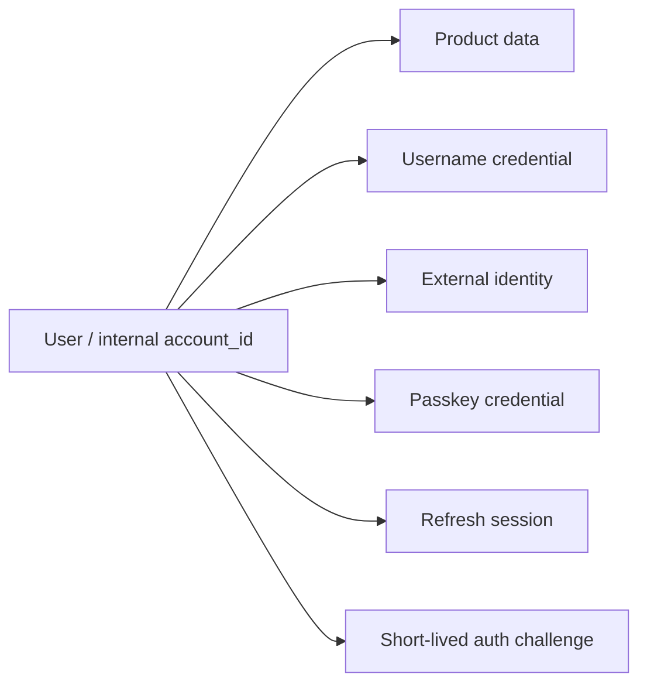

# Identity Foundation Design

## Architecture

`users.id` becomes the immutable internal account ID. New accounts receive a
random UUID-based value; existing IDs remain unchanged to avoid rewriting every
business table. `user_credentials.username` remains a mutable login handle and
password credential, but it no longer determines the new account ID.

The authentication domain owns token creation and verification. Provider
adapters implement a small `IdentityVerifier` protocol and return only verified,
minimal identity claims. Mapping `(provider, issuer, subject_hash)` to the
internal account is a separate step, which prevents provider claims from leaking
into product ownership logic.

## Data model

- `users`: add `status` and monotonic `token_version`.
- `auth_identities`: provider, issuer, keyed subject hash, account, lifecycle
  timestamps. Raw external subjects and profile claims are not persisted.
- `auth_sessions`: random session ID, refresh secret hash, expiry, rotation and
  revocation metadata. The raw secret exists only in the Web cookie or native
  platform secure storage.
- `passkey_credentials`: credential ID, COSE public key, opaque user handle, and
  authenticator metadata. Empty until a stable RP ID is configured.
- `auth_challenges`: hashed single-use challenges with flow, RP/origin context,
  expiry, and consumption timestamp.

## Token and browser flow

Access tokens use the internal account ID as `sub`, include issuer, audience,
type, JWT ID, and account token version, and expire quickly. Refresh credentials
use `<session_id>.<random_secret>`; only a SHA-256 hash of the secret is stored.
Every refresh rotates the credential and revokes the previous session.

The same-origin web client receives refresh credentials in an HttpOnly,
Secure-in-production, SameSite=Lax cookie. It keeps the access token in memory
and calls `/v1/auth/refresh` after reload. Native clients explicitly select the
`native` transport and store the returned rotating credential in Keychain or
Keystore. Password reauthentication remains a compatibility fallback for the
current generated guest account.

## Security and privacy

- Login errors remain uniform and failed-login telemetry is not associated with
  an attacker-supplied username.
- Provider identity lookup uses a stable keyed hash. Email and display claims
  cannot trigger automatic account linking.
- Refresh, password, provider, Passkey, and challenge secrets are excluded from
  export and logs.
- Account deletion explicitly inventories all new account-owned tables.
- Production startup requires stable JWT and identity hashing secrets when
  authentication is enabled.

## Migration strategy

The Alembic migration adds the new columns and tables without changing existing
user IDs. New registrations immediately use opaque IDs. Existing username rows
continue to authenticate to their existing IDs, creating a refresh session on
the first successful login. This is an online-compatible transition and avoids
a high-risk bulk rewrite of psychological-support data.

## Verification

Unit tests cover opaque registration IDs, legacy login, access-token claims,
refresh rotation/replay rejection, logout, deletion inventory, and provider
identity uniqueness. Existing authentication, ownership, privacy, and frontend
tests must continue to pass.
